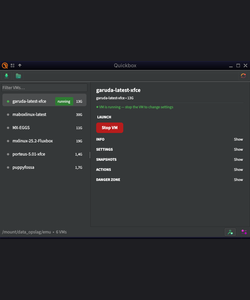
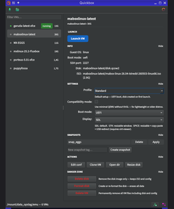
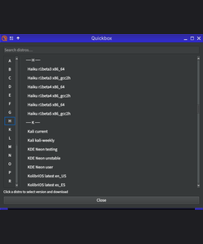
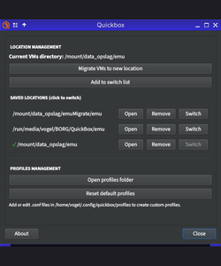
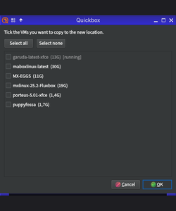
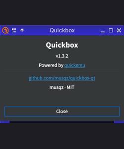

# quickbox-qt --- GUI for quickemu

<p align="center">
  
</p>

<p align="center">
  <a href="https://github.com/musqz/quickbox-qt/releases"></a>
  
  
  
  
</p>

A Qt6/PySide6 GUI front-end for [quickemu](https://github.com/quickemu-project/quickemu).

Ported from the original [quickbox](https://github.com/musqz/quickbox) GTK version.

<table align="center">
  <tr>
    <td align="center">
      <a href="docs/screenshots/main.png"></a><br/>
      <sub>Main window</sub>
    </td>
    <td align="center">
      <a href="docs/screenshots/settings.png"></a><br/>
      <sub>VM settings</sub>
    </td>
    <td align="center">
      <a href="docs/screenshots/download.png"></a><br/>
      <sub>Download distros</sub>
    </td>
  </tr>
  <tr>
    <td align="center">
      <a href="docs/screenshots/advanced.png"></a><br/>
      <sub>Locations &amp; profiles</sub>
    </td>
    <td align="center">
      <a href="docs/screenshots/migrate.png"></a><br/>
      <sub>Migrate VMs</sub>
    </td>
    <td align="center">
      <a href="docs/screenshots/about.png"></a><br/>
      <sub>About</sub>
    </td>
  </tr>
</table>

## Features

- Browse, launch, and manage quickemu VMs from a clean Qt6 interface
- Download distros via `quickget` with live progress
- Snapshot management (create, apply, delete)
- Clone and migrate VMs
- Custom VM creation from local ISO/IMG files
- Per-VM display backend selector (SDL / GTK / SPICE via virt-viewer)
- System tray support
- Translations for 17 languages

## Requirements

- Python 3.10+
- PySide6
- quickemu / quickget
- python-gobject (`gi` — GLib version guard)

## Installation

### Arch Linux

```sh
yay -S quickbox-qt
```

### Debian

[Quickbox-qt debian](https://github.com/musqz/quickbox-qt/releases/tag/v1.3.2)

### Manual

```sh
# Install dependencies
pip install PySide6
or
yay -S pyside6

# Run directly
./quickbox
```

## Usage

```sh
quickbox
```

VMs are read from `~/emu` by default. The location can be changed or
extended via the Advanced panel inside the app.

## Translations

JSON files live in `translations/`. Add a new file named `<lang_code>.json`
matching the keys in any existing translation to add a new language.

## Credits

Quickbox-qt is just a GUI — all the actual VM work (downloading, booting, disk handling) is done by [quickemu](https://github.com/quickemu-project/quickemu). Quickbox-qt wouldn't exist without it.

## License

MIT — see [LICENSE](LICENSE).

---

> Parts of this tool were built with AI assistance (Claude by Anthropic). All code has been reviewed and tested by the author.
