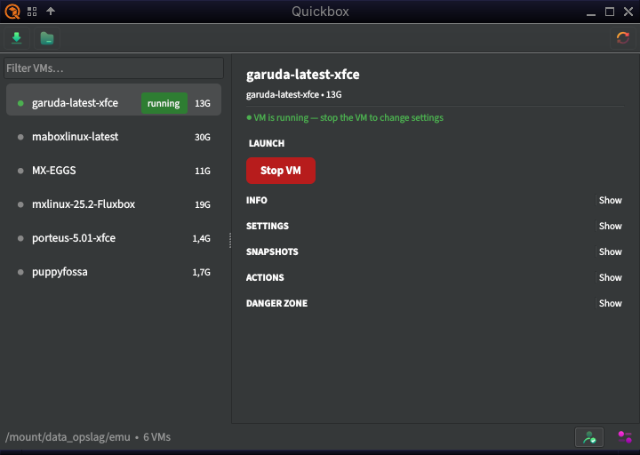
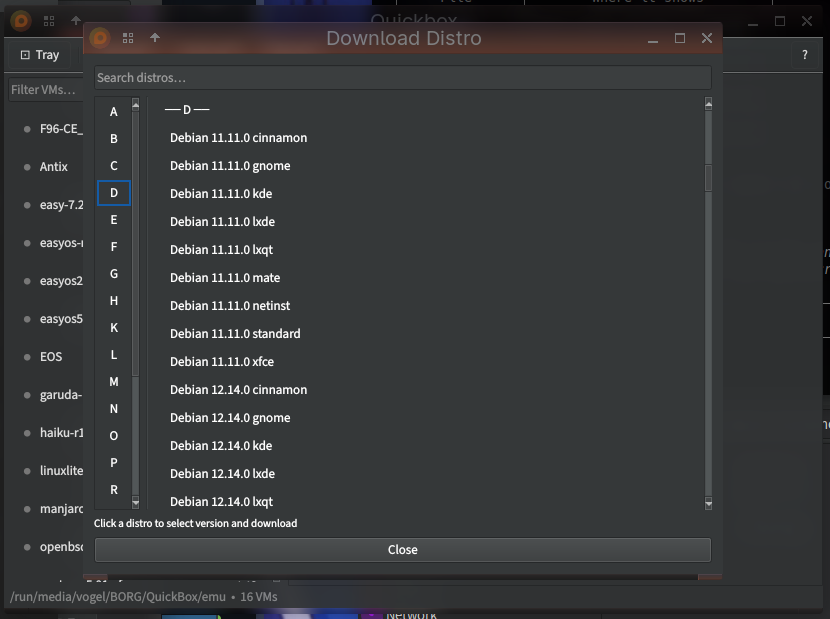
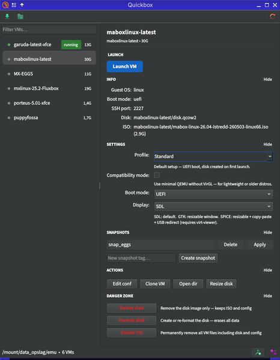
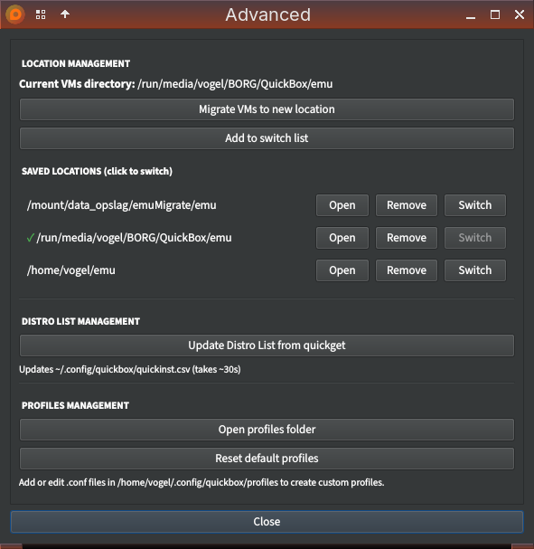

# quickbox-qt --- GUI for quickemu

<p align="center">
  
</p>

> **Beta** — actively developed and tested. Not yet published to AUR or any distro repository. Feedback welcome.

A Qt6/PySide6 GUI front-end for [quickemu](https://github.com/quickemu-project/quickemu).

Ported from the original [quickbox](https://github.com/musqz/quickbox) GTK version.



<details>
<summary>More screenshots</summary>





</details>

## Features

- Browse, launch, and manage quickemu VMs from a clean Qt6 interface
- Download distros via `quickget` with live progress
- Snapshot management (create, apply, delete)
- Clone and migrate VMs
- Custom VM creation from local ISO/IMG files
- Per-VM display backend selector (SDL / GTK / SPICE via virt-viewer)
- System tray support
- Translations for 17 languages

## Requirements

- Python 3.10+
- PySide6
- quickemu / quickget
- python-gobject (`gi` — GLib version guard)

## Installation

### Arch Linux — local PKGBUILD (beta testing)

```sh
cd pkg
makepkg -si
```

> AUR package is planned but not yet published.

### Manual

```sh
# Install dependencies
pip install PySide6

# Run directly
./quickbox
```

## Usage

```sh
quickbox
```

VMs are read from `~/quickemu` by default. The location can be changed or
extended via the Advanced panel inside the app.

## Translations

JSON files live in `translations/`. Add a new file named `<lang_code>.json`
matching the keys in any existing translation to add a new language.

## License

MIT — see [LICENSE](LICENSE).
